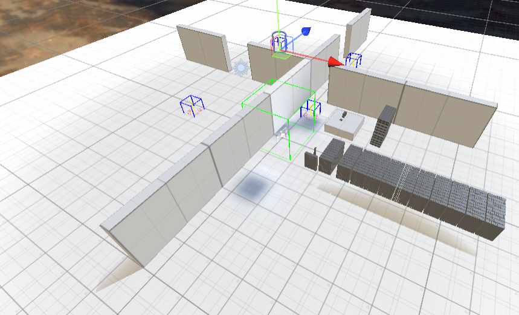

# CS567 Fall 2021 - Final Project
[editor on GitHub (TODO: Remove this line)](https://github.com/csu-hci-projects/Visualization-of-3D-data-for-Education/edit/main/docs/index.md)

## Project Title
Visualization of 3D data for Education

## AUTHORS
[Brent Staab](bstaab@colostate.edu)\
[Nate Higgins](nate.higgins@colostate.edu)

## DESCRIPTION
One of the essential things to figure out with Virtual Reality (VR) is the possible daily uses of VR. While a lot of the industry is focused on video games, educational applications are also popular. Visualizing data and information in a 3D human-computer interface (HCI) could enhance conceptual understanding over traditional 2D means of data display. To test this benefit, this project will focus on displaying different economic information through a 3D environment that users can interact with for better comprehending values versus the impressions humans already have of money. This can compare an enormous sum of money to something that a regular person might have held in their hand. The experiment will compare a small number of economic data points in a 3D environment and compare it against an experience of just a 2D data representation and presentation. Through pre-, post-, and mid-experiment surveys, knowledge accrual can be measured for each test subject.

## MOTIVATION (WHY DOES THIS MATTER?)
TODO+

## METHODOLOGY
To test our hypothesis, we have created a controlled experiment that will be conducted on a pool of participants. Two experiences will be prepared that present the same information in two different formats. The first will be a traditional presentation with audio and video; second will be in virtual reality using Oculus Quest. The participants will be split evenly between watching the video and using the Oculus Quest to learn the financial information we seek to communicate. At this point, they will take a mid-experiment quiz to test the acquisition of knowledge. Then participants will get a chance to use the medium they did not experience first. After this, participants will take an impression survey to find out personal preferences and changing opinions. The order of the surveys is essential for analytical integrity. It is important to alternate the subjects’ paths for more accurate comparative data, so there is no preference for a first experience. Additionally, having the knowledge acquisition test in the middle allows for correct data reflection of which interaction gives more acquisition. The initial test will establish a baseline for knowledge to measure the resulting change and avoid exceptionally knowledgeable outliers\

    
   figure 1

    
   figure 2

## RESULTS
TODO

## CONCLUSION
Human life occurs in 3D space, and the human mind is optimized to process this type of information.  Presenting new information in a form people are inherently familiar with will increase the ability to learn new material and be the preferred method despite the long history with the previous 2D method. This experiment hopes to further future educational endeavors in the VR field as it becomes increasingly accepted as a learning tool for all levels of education.

Proving that taking abstract items like money and scale of wealth and turning it into a VR experience would be helpful for moving forward with future experiences. Many history and world language programs would love to show cultural milestones that are hard to grasp through pictures. Math could have an easier time representing solids and Chemistry could have a unique way to demonstrate how bonding looks on a molecular scale. Proving first that the learning method is more effective for acquisition will help lead to future development and adoption.

## LINKS
[Project GitHub](https://github.com/csu-hci-projects/Visualization-of-3D-data-for-Education)\
[Checkpoint01.mp4](https://drive.google.com/file/d/17zsgbmZUYox_kL2-4srWOPxgRpxV53nr/view?usp=sharing)\
[Checkpoint02.mp4](https://drive.google.com/file/d/1Gu53qqn4STPEQfjO6AYCf5tFGG4i0npr/view?usp=sharing)

