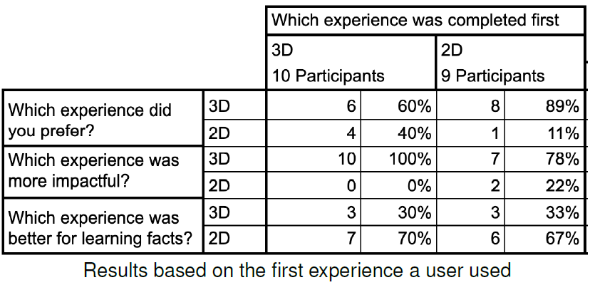
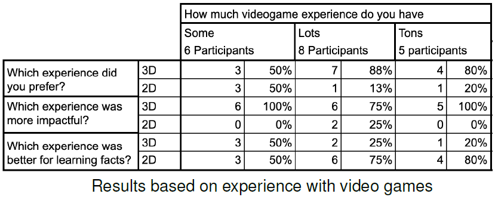
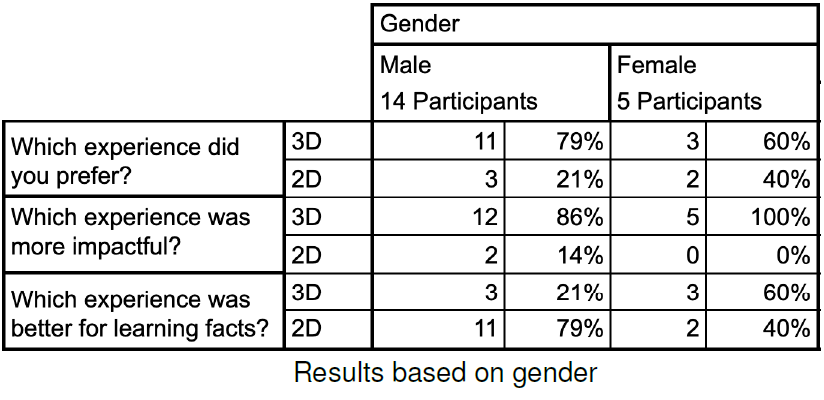

# CS567 Fall 2021 - Final Project

## Project Title
Visualization of 3D data for Education

## AUTHORS
[Brent Staab](bstaab@colostate.edu)\
[Nate Higgins](nate.higgins@colostate.edu)

## DESCRIPTION
One of the essential things to figure out with Virtual Reality (VR) is the possible daily uses of VR. While a lot of the industry is focused on video games, educational applications are also popular. Visualizing data and information in a 3D human-computer interface (HCI) could enhance conceptual understanding over traditional 2D means of data display. To test this benefit, this project will focus on displaying different economic information through a 3D environment that users can interact with for better comprehending values versus the impressions humans already have of money. This can compare an enormous sum of money to something that a regular person might have held in their hand. The experiment will compare a small number of economic data points in a 3D environment and compare it against an experience of just a 2D data representation and presentation. Through pre-, post-, and mid-experiment surveys, knowledge accrual can be measured for each test subject.

## METHODOLOGY
To test our hypothesis, we have created a controlled experiment that will be conducted on a pool of participants. Two experiences will be prepared that present the same information in two different formats. The first will be a traditional presentation with audio and video; second will be in virtual reality using Oculus Quest. The participants will be split evenly between watching the video and using the Oculus Quest to learn the financial information we seek to communicate. At this point, they will take a mid-experiment quiz to test the acquisition of knowledge. Then participants will get a chance to use the medium they did not experience first. After this, participants will take an impression survey to find out personal preferences and changing opinions. The order of the surveys is essential for analytical integrity. It is important to alternate the subjects’ paths for more accurate comparative data, so there is no preference for a first experience. Additionally, having the knowledge acquisition test in the middle allows for correct data reflection of which interaction gives more acquisition. The initial test will establish a baseline for knowledge to measure the resulting change and avoid exceptionally knowledgeable outliers.  The following images are a representation of the 2D (PowerPoint) and 3D (Oculus Quest) presentations.

 

## PARTICIPANTS
The pool of participants is made up of students and faculty from Valor Christian High School. The requirements were 
• Minimum of eighteen years old 
• Able to communicate in spoken and written English 
• Have normal or corrected-to-normal vision 
A total of 19 people participated in the study (14 male, 5 female) with a mix of high school students and adults ranging from 18 to 60. The participation is voluntary, and no form of compensation will be provided. Participants will be given an intro survey and quiz that involve impressions of the desired form of interaction, previous experience with VR equipment, and an examination to assess prior knowledge.

## RESULTS
The acquisition of knowledge is qualitatively measured as the difference betwen the pre-quiz and mid-quiz.  The average base line score from participants entering blindly was four out of a possible nine. For both experiences, the midpoint score was identical to each other and the average improvement for both experiences was three additional questions correct reaching an average of seven correct post-experience. This actually was surprising as the data was not always presented consistently between both experiences.  

 

During the presentation, participants were monitored to see if there were any user reactions. Many people had expressions of astonishment especially when seeing a billion dollars. One participant said ”Oh wow and there is a billion dollars”. Many other exclamations of wonder at the size of things were common during the VR experience. During the PowerPoint, participants didn’t react and instead were engaged in reading the material for understanding. There was a clear difference in excitement for the VR experience. Data was broken down in a variety of ways including by experience used, familiarity with video games, age group, and gender.

    
    

    
    

The first question was focused on overall preference. The question was ”Which presentation format did you prefer?” This question was looking for overall impression from the users. The results for all participants were that 14 participants (74%) with 5 (26%) prefering the PowerPoint. Most users found the VR to be a better overall experience for their learning, but it did not represent a consensus. The second question focused on how big of an impact the experience was for a greater realization about the scope of money as that was one of the primary goals of the study. The question was ”Which experience was more impactful to your understanding of wealth around the world?” This core question looked to really capture the difference between learning facts and understanding greater concepts. Participants preferred VR by a margin of 17 (89%) to only 2 (11%) which speaks to the impact of hands on interaction versus a traditional PowerPoint. Finally the study was concerned about perception of how data was acquired. Since the goal would be to replace traditional learning experiences with VR, it is important to see how participants felt that they could acquire information from the experience as a whole. The question was: ”Which experience helped communicate the necessary information for the quiz you took?” This question showed that participants favored PowerPoint for pure fact based acquisition by a factor of 13 (68%) to only 6 (32%) favoring the VR interaction.

## CONCLUSION
VR experiences offer a unique way to learn that hasn’t been explored extensively. Based on participant reactions it is clear that many different users found value in this interaction. The VR experience doesn’t appear to have any loss in core data acquisition and with more refinement, future learning tools could be built to be more accessible for teachers to develop curricula in. Participants found a unique interaction that many had no prior experience with and in conjunction with traditional techniques hybrid learning between both mediums would likely be very beneficial. Human life occurs in 3D space, and the human mind is optimized to process this type of information. Presenting new information in a form people are inherently familiar with will increase the ability to learn new material and be the preferred method despite the long history with the previous 2D method. This experiment hopes to further future educational endeavors in the VR field as it becomes increasingly accepted as a learning tool for all levels of education.
  
Proving that taking abstract items like money and scale of wealth and turning it into a VR experience would be helpful for moving forward with future experiences. Many history and world language programs would love to show cultural milestones that are hard to grasp through pictures. Math could have an easier time representing solids and Chemistry could have a unique way to demonstrate how bonding looks on a molecular scale. Proving first that the learning method is more effective for acquisition will help lead to future
development and adoption.

## LINKS
[Project GitHub](https://github.com/csu-hci-projects/Visualization-of-3D-data-for-Education)\
[Checkpoint01.mp4](https://drive.google.com/file/d/17zsgbmZUYox_kL2-4srWOPxgRpxV53nr/view?usp=sharing)\
[Checkpoint02.mp4](https://drive.google.com/file/d/1Gu53qqn4STPEQfjO6AYCf5tFGG4i0npr/view?usp=sharing)\
[ShortVideo.mp4](https://TODO)\
[PresentationVideo.mp4](https://TODO)

